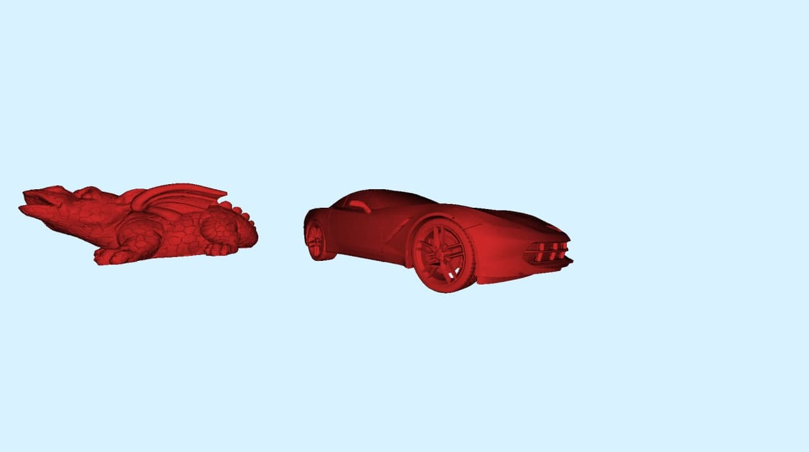
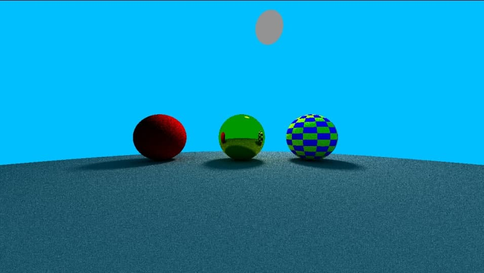
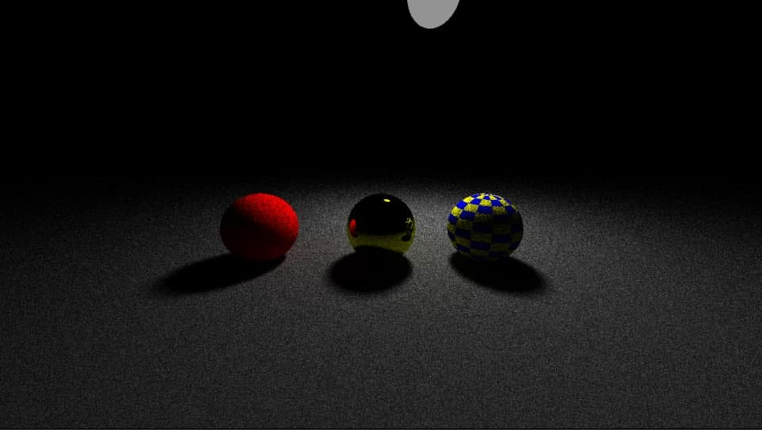
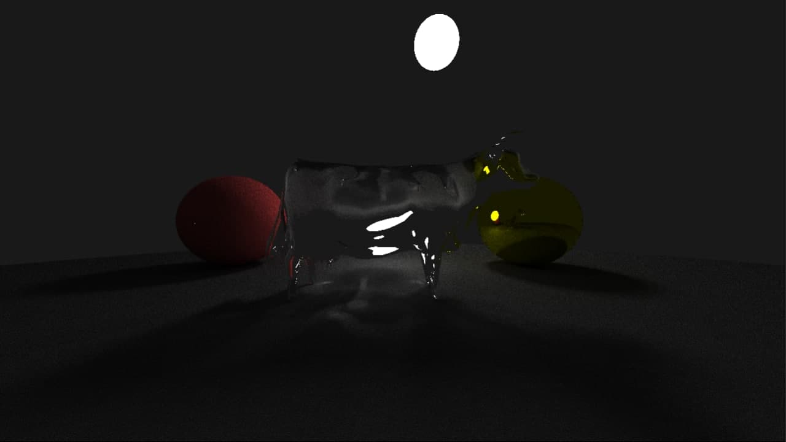
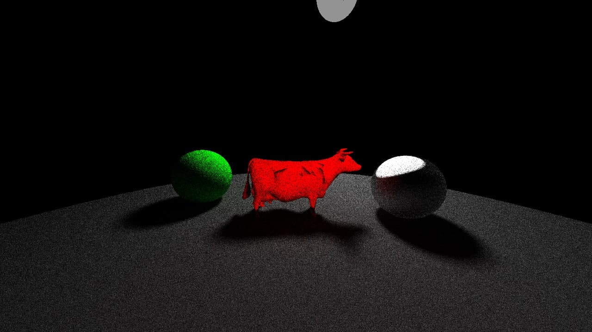
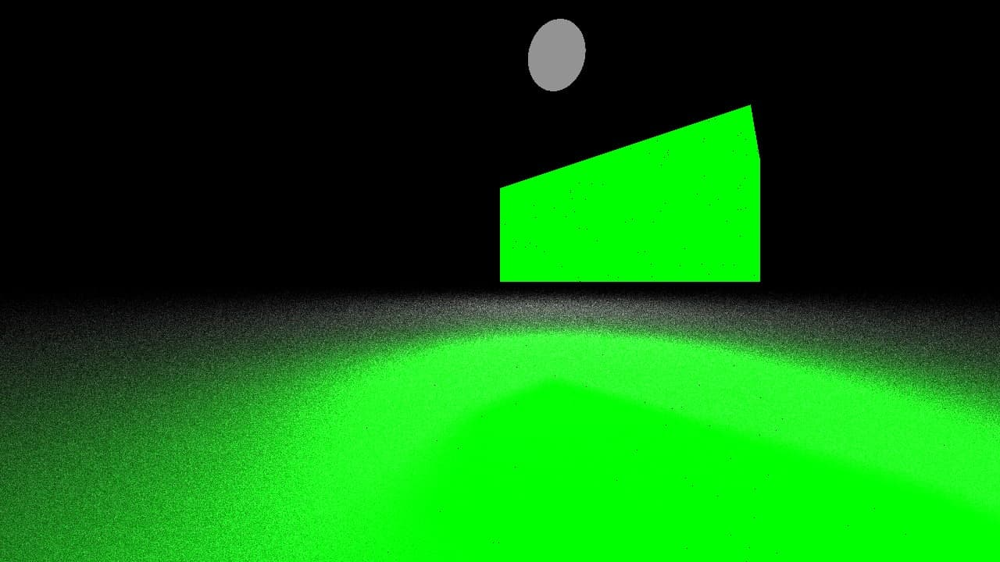
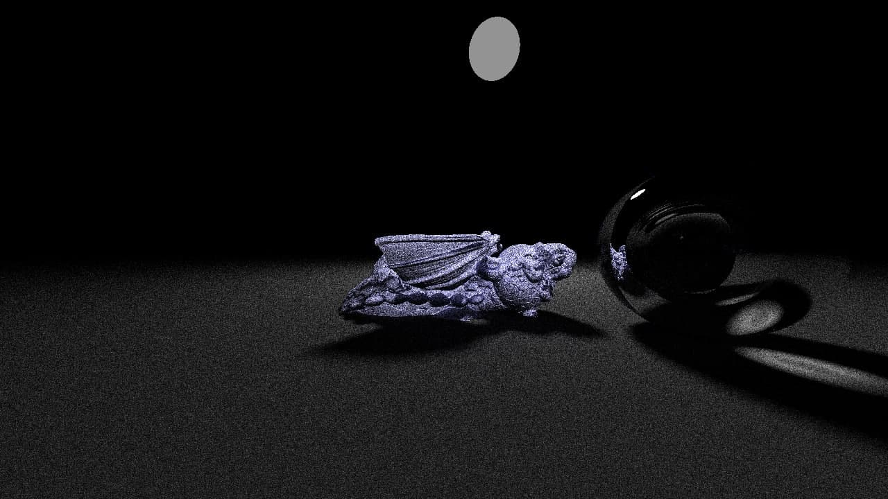

# Part 1. Image converter

We've implement JPEG Encoder and GIF Decoder. This was implemented using pluggable architecture, so the best way to
understand it would be to create another plugin.

### 1. Create new project

Every plugin should contain reference to `ComputerGraphics.Converters.Sdk`. This project defines common interfaces and
contracts which are used by plugin loader to load and resolve different plugins. The only way to do it for now is to
clone this repository and add another project to a solution (let's call it `ComputerGraphics.Converters.Ppm`). This
project should reference `ComputerGraphics.Converters.Sdk`. Also we need to make some changes to project file for it to
not to expose SDK (as it is already included in application and there might be some conflicts between versions).

To do this, we should change `ComputerGraphics.Converters.Ppm.csproj` file and replace its content with

```xml <Project Sdk="Microsoft.NET.Sdk">
    <PropertyGroup>
        <TargetFramework>net5.0</TargetFramework>
    </PropertyGroup>

    <ItemGroup>
        <ProjectReference Include="..\ComputerGraphics.Converters.Sdk\ComputerGraphics.Converters.Sdk.csproj">
            <Private>false</Private>
            <ExcludeAssets>runtime</ExcludeAssets>
        </ProjectReference>
    </ItemGroup>

</Project>
```

### 2. Add some code

SDK has 2 public interfaces, `IImageEncoder` and `IImageDecoder`. We don't have to implement both, so let's implement
encoder. To do this, we should create a class which implements interface ```IImageEncoder```. For example:

```csharp
using ComputerGraphics.Converters.Sdk.Interfaces;
using ComputerGraphics.Converters.Sdk.Model;

namespace ComputerGraphics.Converters.Ppm
{
    internal class PpmEncoder : IImageEncoder
    {
        public byte[] Encode(RgbColor[,] colors)
        {
            throw new System.NotImplementedException();
        }
    }
}
```

Now let's add some very basic implementation

```csharp
        public byte[] Encode(RgbColor[,] colors)
        {
            var result = new StringBuilder("P3\n");
            int width = colors.GetLength(0);
            int height = colors.GetLength(1);
            result.Append(width).Append(' ')
                .Append(height)
                .Append('\n');
            result.Append("255\n");
            for (int i = 0; i < height; i++)
            {
                for (int j = 0; j < width; j++)
                {
                    var color = colors[j, i];
                    result
                        .Append(color.R).Append(' ')
                        .Append(color.G).Append(' ')
                        .Append(color.B)
                        .Append('\n');
                }
            }

            return Encoding.ASCII.GetBytes(result.ToString().TrimEnd('\n'));
        }
```

Also, after we implemented this we should also add ```ImageEncoderAttribute``` to our class. It is used to determine
which file format should be encoded by this encoder. Format is passed using constructor. Also multiple formats can share
same implementation (as it is done, for example, for JPEG encoder, which works with bot \*.jpg and ".jpeg files).
**Note**: if an encoder is not marked with this attribute, a warning message will be displayed in console, and this
converter won't be used (because we don't know which format should it encode). If there are 2 encoders for same format a
warning message will be also displayed

### 3. Build

Finally you are to build your project in release mode, then go `/bin/obj/net5.0/win-x64` copy your dll. Then you need to
paste it into `Plugins` folder. That's it.

# Part 2. Ray tracer

We've implemented Ray Tracer with the intersection search optimization by the KD-Tree. You can find some of the rendered images below.


# Part 3. Complex scenes, realistic lights and materials

We've implemented procession of complex scenes.

Implemented Scene Objects:
- Mesh
- Oriented Bounding Box
- Sphere
- Plane
- Disk
- Pyramid (WIP)

Implemented Materials:
- Dieletric
- Lambert (supports textures)
- Metal
- Specular highlight (Cook-Torrance model WIP)

Implemented Cameras:
- Perspective
- Orthographic

You can find some of the rendered images below.






